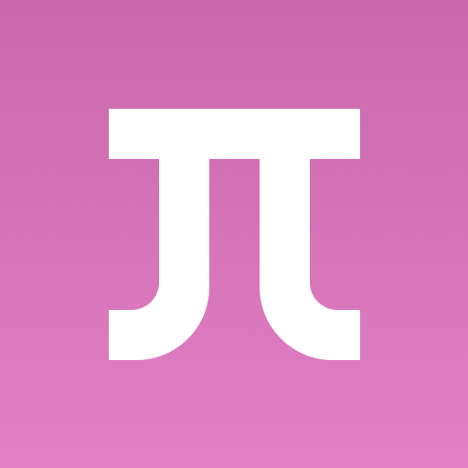

# Embeddium For Holy GL4ES

Embeddium unofficial fork, compatible with Holy-GL4ES renderer, please do not use this fork when any problems occurred feedback to the original Embeddium repository！！！

Embeddium is a free and open-source performance mod for Minecraft clients. It is based on the last FOSS-licensed version of the Sodium codebase, and includes additional bugfixes & features for better mod compatibility.

Despite being forked from Sodium, Embeddium is **not supported by CaffeineMC**. Do not report issues encountered with it to their bug tracker or in their Discord - please open an issue on our [Issues page](https://github.com/FiniteReality/embeddium/issues).

## Highlights

* All performance improvements from Sodium 0.5.8 and earlier, i.e. a rewritten terrain renderer, various optimizations to the immediate-mode rendering pipeline (used by entities, GUIs, block entities, etc.), and other miscellaneous improvements
* Available for Minecraft Forge on 1.20.1 and older, and Fabric/NeoForge on 1.20.1 and newer
* Integrated Fabric Rendering API support (Indium is no longer required, and will not work with Embeddium)
* Frequent patch updates to fix mod compatibility issues soon after being reported & reproduced
* Additional APIs for mod integration
* Optional support for translucency sorting (can be enabled in Video Settings)

## For developers

If you're looking to add Embeddium to your development environment, please take a look at the [dedicated wiki page](https://github.com/FiniteReality/embeddium/wiki/For-Developers) for instructions & recommended guidelines for integration.

## Credits

* JellySquid & the CaffeineMC team, for making Sodium in the first place, without which this project would not be possible
* Asek3, for the initial port to Forge
* XFactHD, for providing a list of gamebreaking Rubidium issues to start this work off, and for testing early builds
* Pepper, for their invaluable assistance with getting Forge lighting to work on Sodium 0.5
* @CelestialAbyss and @input-Here for making the new logo design

## License

Embeddium is licensed under the Lesser GNU General Public License version 3.

Portions of the option screen code are based on Reese's Sodium Options by FlashyReese, and are used under the terms of
the [MIT license](https://opensource.org/license/mit), located in `src/main/resources/licenses/rso.txt`. 
